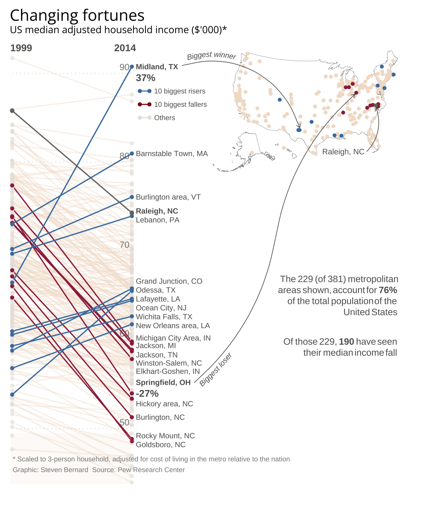
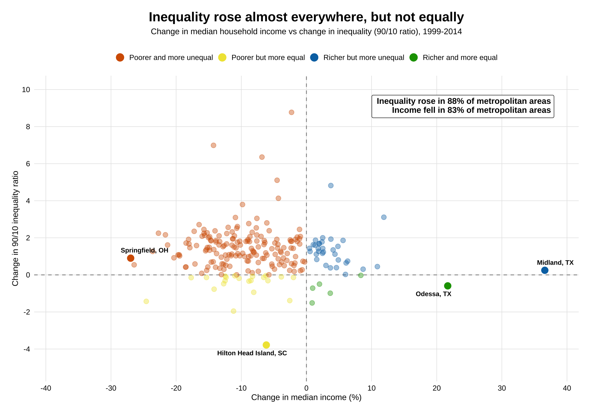

# Changing Fortunes: Replicating a Financial Times Visualization in R



> A replication and analytical extension of the Financial Times graphic *"Changing Fortunes"* (Steven Bernard, FT), showing shifts in US median adjusted household income across 229 metropolitan areas between 1999 and 2014.

------------------------------------------------------------------------

## Overview

This project replicates a publication-quality Financial Times slope chart using R, then extends it with an analytical scatterplot that reveals relationships between income change and inequality metrics. The goal is both technical — matching the FT's visual style precisely — and analytical — adding insight beyond the original graphic.

The original graphic was published by the *Financial Times* based on data from the **Pew Research Center** (*"The American Middle Class Is Losing Ground"*, 2015).

------------------------------------------------------------------------

## What's Inside

| File | Description |
|------------------------------------|------------------------------------|
| `Main_Script.Rmd` & `Main_Script.html` | Main R script: slope chart + US map + cowplot assembly |
| `Clean_Median_Data.csv` | Cleaned median income data (1999 & 2014) for 229 metros |
| `geocoded_data.csv` | Geocoded coordinates for metro areas (via OpenStreetMap) |
| `MiddleClassU_S_MetroAreas51216SupplementaryTables.xlsx` | Raw supplementary tables from Pew Research Center |
| `changing_fortunes_replication.png` | Final rendered output |
| `alternative_plot.png` | My alternative plot that also showcases the inequality dimension |

------------------------------------------------------------------------

## Visualization Components

The final graphic combines three elements assembled with `cowplot`:

1.  **Slope Chart** — Each line is a metropolitan area, connecting its 1999 and 2014 median income. Top 10 risers (blue), top 10 fallers (dark red), and Raleigh NC (gray highlight) are emphasized over muted background lines.

2.  **US Map** — Dots placed at geocoded metro coordinates, color-coded by category, showing the geographic distribution of winners and losers.

3.  **Annotation Layer** — Curved arrows with text labels (via `geomtextpath`) pointing from the slope chart to map locations, replicating the FT's editorial annotation style.

------------------------------------------------------------------------

## Key Design Choices

-   **Color palette** matches FT print style: muted beige for background metros, `#477FB0` for risers, `#9D2B4D` for fallers
-   **Open Sans** font loaded via `sysfonts` + `showtext` to match FT typography
-   **Gradient opacity** on background lines reduces visual noise without losing context — think of it like a concert crowd: you want to feel the mass without being distracted by individual faces
-   **Manual dotted gridlines** replace ggplot defaults for finer control
-   **Curved text arrows** (`geomtextpath`) required a two-segment approach for the "Biggest loser" annotation to avoid label collision

------------------------------------------------------------------------

## Analytical Extension

Beyond replication, the project includes a **quadrant scatterplot** relating:

\- X-axis: % change in median household income (1999–2014)\
- Y-axis: Gini coefficient (inequality measure)

This reveals that many metros with falling incomes also have *high inequality* — a pattern invisible in the original slope chart.



------------------------------------------------------------------------

## Requirements

``` r
install.packages(c(
  "tidyverse", "ggrepel", "maps", "sf", "usmap",
  "ggtext", "cowplot", "geomtextpath",
  "sysfonts", "showtext"
))
```

R version 4.2+ recommended.

------------------------------------------------------------------------

## Data Sources

-   **Pew Research Center** — *"The American Middle Class Is Losing Ground"* (December 2015)\
    <https://www.pewresearch.org/social-trends/2015/12/09/the-american-middle-class-is-losing-ground/>

-   **Original graphic** — Steven Bernard, *Financial Times*

-   **Geocoding** — OpenStreetMap via `tidygeocoder`

------------------------------------------------------------------------

## How to Run

1.  Clone the repository
2.  Place `Clean_Median_Data.csv` and `geocoded_data.csv` in the working directory
3.  Open `Main_Script.Rmd` and run top to bottom
4.  Output renders to the RStudio Plots pane; export at \~3000×2400px for print quality

------------------------------------------------------------------------

## Notes on Geocoding

Several metro areas were incorrectly matched by the geocoder (e.g., matched cities outside the US with similar names). Manual coordinate corrections are applied in the script via a `tribble` lookup table — documented inline.

------------------------------------------------------------------------

## License

Data from the Pew Research Center is publicly available for research and educational use. The original FT graphic is the intellectual property of the Financial Times. This project is an independent academic replication exercise and is not affiliated with the FT.

------------------------------------------------------------------------

## Acknowledgements

Original graphic: **Steven Bernard**, Financial Times\
Data: **Pew Research Center**\
Replication: Tommaso Accornero — Academic Visualization Project
